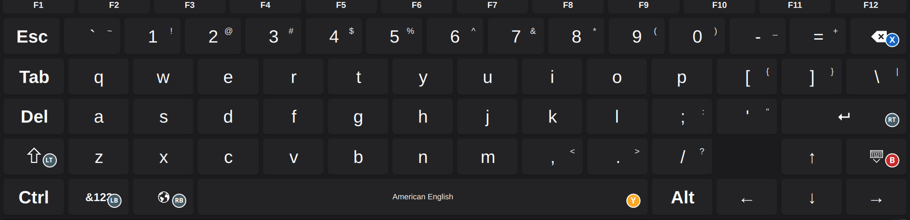
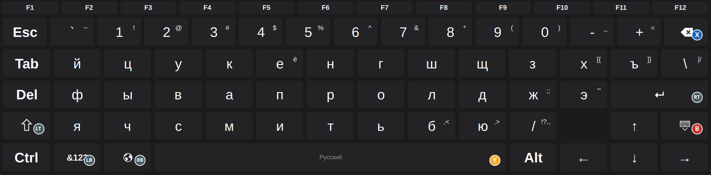
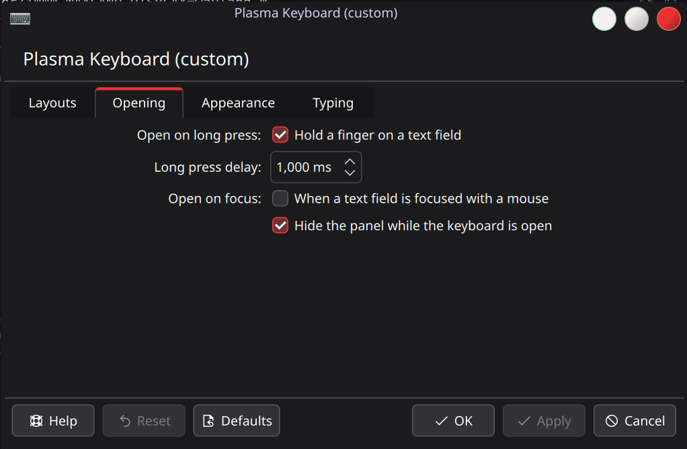
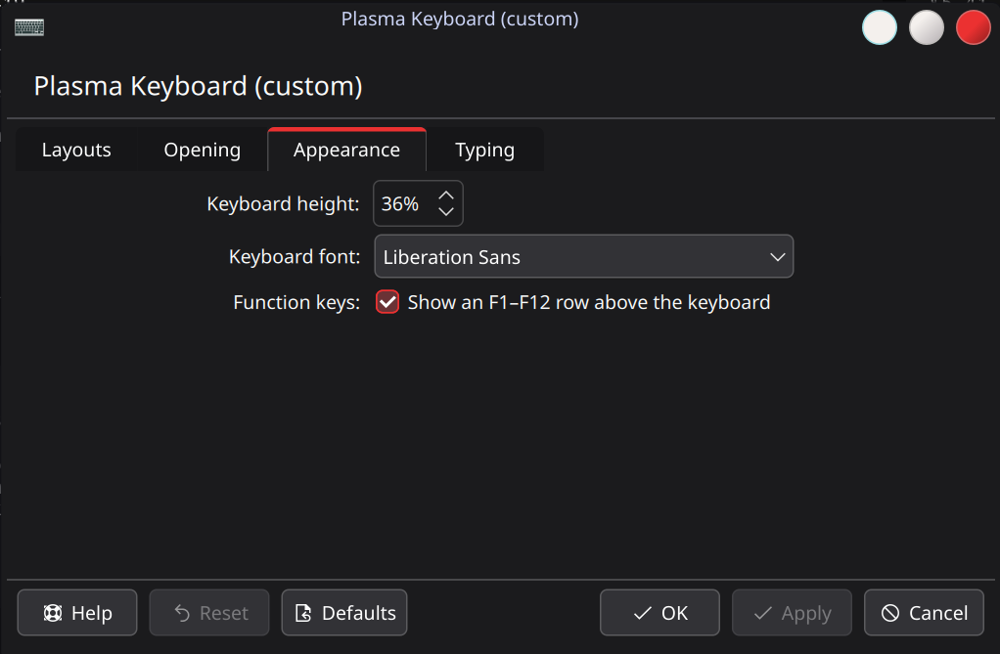
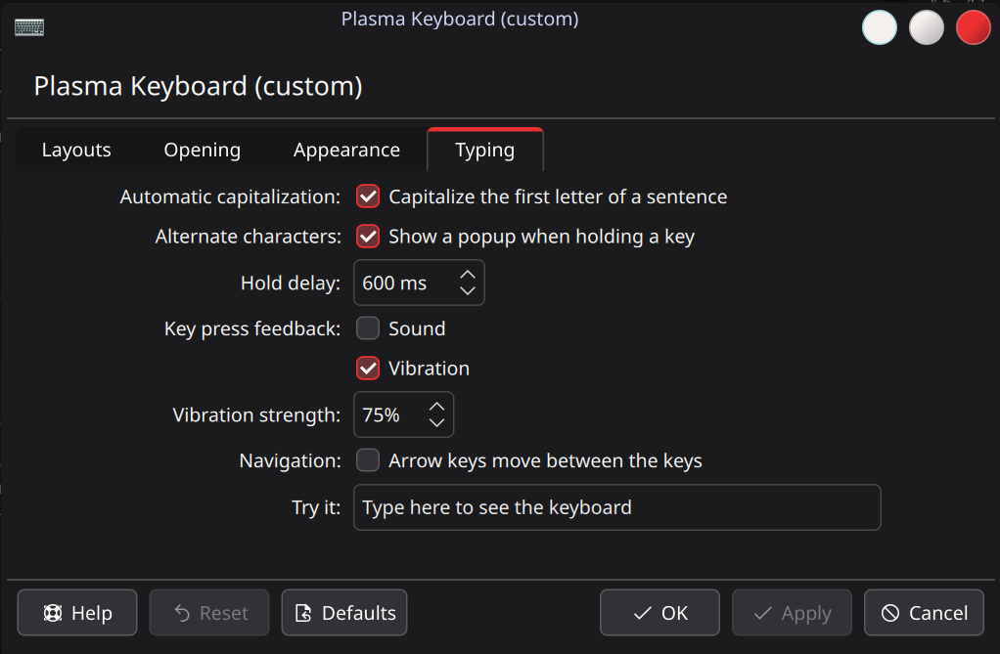

<!--
  - SPDX-FileCopyrightText: None
  - SPDX-License-Identifier: CC0-1.0
-->

# Plasma Keyboard (кастомный форк)



> **Эта ветка/репозиторий — `plasma-keyboard-custom`**, форк
> [KDE plasma-keyboard](https://invent.kde.org/plasma/plasma-keyboard) с дополнительной функциональностью для
> handheld / gamepad-использования (MSI Claw, CachyOS + KDE Plasma 6 Wayland). Он устанавливается **рядом**
> с официальным пакетом и не заменяет его — см.
> [plasma-keyboard-custom (форк)](#plasma-keyboard-custom-форк) ниже.

[English version](README.md)

plasma-keyboard — это виртуальная клавиатура на основе [Qt Virtual Keyboard](https://doc.qt.io/qt-6/qtvirtualkeyboard-overview.html), предназначенная для интеграции в Plasma.

Она оборачивает Qt Virtual Keyboard в окно и использует Wayland-протокол input-method-v1 для связи с композитором, работая как метод ввода.

## plasma-keyboard-custom (форк)

### Установка последнего релиза

Самый быстрый способ — [install script](install.sh): он берёт новейший релиз, скачивает пакет, сверяет его с
опубликованным `SHA256SUMS`, устанавливает через `pacman -U` и перезапускает клавиатуру, так что репозиторий
pacman настраивать заранее не нужно (требуются только `curl` и `pacman`, поскольку пакеты собраны для систем
на базе Arch):

```sh
curl -fsSL https://raw.githubusercontent.com/mops1k/plasma-keyboard-custom/master/install.sh | sh
```

Опции передаются через `sh -s --`:

| Опция | Значение |
| --- | --- |
| `--tag <tag>` | установить этот релиз вместо последнего |
| `--overwrite` | разрешить pacman заменять файлы, которые он не отслеживает (например, после ручного `cmake --install`) |
| `--no-restart` | не перезапускать работающую клавиатуру |
| `--dry-run` | скачать и проверить пакет, ничего не устанавливая |
| `-h`, `--help` | справка |

Запустите его снова для последующих обновлений или добавьте [pacman-репозиторий](#установка-из-pacman-репозитория)
ниже, и пусть это сделает `sudo pacman -Sy plasma-keyboard-custom`.

Вручную — то же самое: скачайте новейший `plasma-keyboard-custom-*-x86_64.pkg.tar.zst` со
[страницы Releases](https://github.com/mops1k/plasma-keyboard-custom/releases/latest):

```sh
url=$(curl -fsSL https://api.github.com/repos/mops1k/plasma-keyboard-custom/releases/latest \
      | grep -o 'https://[^"]*/plasma-keyboard-custom-[0-9][^"]*\.pkg\.tar\.zst' | head -n1)
curl -fsSLo /tmp/plasma-keyboard-custom.pkg.tar.zst "$url"
```

При желании сверьте его с опубликованными контрольными суммами:

```sh
curl -fsSLo /tmp/SHA256SUMS "${url%/*}/SHA256SUMS"
(cd /tmp && sha256sum -c --ignore-missing SHA256SUMS)
```

Затем установите его:

```sh
sudo pacman -U /tmp/plasma-keyboard-custom.pkg.tar.zst
```

> [!IMPORTANT]
> Готовому пакету нужен **SteamOS 3.8 или новее** (он собран против Qt 6.9 — той версии, что несёт
> SteamOS 3.8). SteamOS 3.7 и старше несут Qt 6.7/6.8 и не могут загрузить бинарники — там собирайте
> пакет из исходников.

В SteamOS это не работает из-за `libstdc++`: пакет собран против текущего Arch, где C++ runtime недавно стал
отдельным пакетом, тогда как SteamOS несёт замороженный снимок, в котором `libstdc++.so.6` принадлежит
`gcc-libs`, а пакета `libstdc++` для скачивания не существует. Сама библиотека уже на месте, поэтому скажите
pacman считать зависимость удовлетворённой:

```sh
sudo pacman -U --assume-installed libstdc++ /tmp/plasma-keyboard-custom.pkg.tar.zst
```

[install script](install.sh) добавляет этот флаг сам, когда в репозиториях нет `libstdc++`, и то же самое
работает при установке из репозитория:
`sudo pacman -S --assume-installed libstdc++ plasma-keyboard-custom`.

Релиз собран против Qt 6.9 — той версии, что несёт SteamOS 3.8, поэтому бинарники несут версию
символов `Qt_6.9` и загружаются как там, так и на текущем Arch/CachyOS (Qt 6.11). Приложение
использует приватные API Qt (Gui и WaylandClient), ABI которых меняется между минорными версиями
Qt, поэтому сборка привязана к снимку Arch, соответствующему SteamOS 3.8 (Qt 6.9.1-5), а не к
текущему Qt. SteamOS 3.7 и старше несут Qt 6.7/6.8 и **не поддерживаются** готовым пакетом — там
собирайте из исходников.

В SteamOS система смонтирована только для чтения, поэтому скрипт выполняет
`sudo steamos-readonly disable` перед установкой и `sudo steamos-readonly enable` после — в том числе
когда установка не удалась. При ручной установке там нужны те же две команды вокруг `pacman`.

**Чтобы обновиться**, запустите ту же команду (или install script) снова — версия пакета (и `pkgrel`)
растёт с каждым релизом, поэтому pacman обновляет установленный пакет на месте. Клавиатура перезапускается
сама и подхватывает новый бинарник; в релизе без этого перезапустите её вручную (или выйдите из сеанса и
войдите снова):

```sh
kwriteconfig6 --notify --file kwinrc --group Wayland --key InputMethod ''
kwriteconfig6 --notify --file kwinrc --group Wayland --key InputMethod \
    '/usr/share/applications/org.kde.plasma.keyboard.custom.desktop'
```

Затем выберите **plasma-keyboard-custom** в **Параметры системы → Виртуальная клавиатура**; её собственные
настройки — в **Параметры системы → Plasma Keyboard (custom)**. Она устанавливается рядом с официальным пакетом
`plasma-keyboard`.

Чтобы собрать пакет самостоятельно: `bash packaging/build.sh`.

### Установка из pacman-репозитория

Каждый опубликованный релиз также помещается в небольшой pacman-репозиторий в ветке `gh-pages`
(`repo/x86_64/`), так что пакет можно устанавливать и обновлять через pacman, а не скачивать вручную. Добавьте
репозиторий один раз в `/etc/pacman.conf` — пакеты не подписаны, отсюда `SigLevel`:

```ini
[plasma-keyboard-custom]
SigLevel = Optional TrustAll
Server = https://mops1k.github.io/plasma-keyboard-custom/repo/$arch
```

Затем установите его и просто запускайте `pacman -Sy plasma-keyboard-custom` снова для каждого нового релиза:

```sh
sudo pacman -Sy plasma-keyboard-custom
```

В SteamOS это требует той же обработки, что и выше, поскольку в его репозиториях нет `libstdc++`:

```sh
sudo pacman -S --assume-installed libstdc++ plasma-keyboard-custom
```

Перезапустите клавиатуру после обновления точно так, как описано выше. Репозиторий всегда публикует
новейший пакет, но сохраняет и предыдущие версии (5 штук) в `repo/x86_64/`, поэтому откат — это одна
команда: pacman не может установить старую версию из базы данных репозитория, поэтому нужен явный пакет:

```sh
sudo pacman -U https://mops1k.github.io/plasma-keyboard-custom/repo/x86_64/plasma-keyboard-custom-<version>-x86_64.pkg.tar.zst
```

Придержите пакет (`IgnorePkg = plasma-keyboard-custom` в `/etc/pacman.conf` или
`pacman -Syu --ignore plasma-keyboard-custom`), если последующее обновление не должно отменить откат.
Старые версии также остаются привязанными к своим релизам на GitHub и в `/var/cache/pacman/pkg/` до
`pacman -Sc`.

Репозиторий поддерживается автоматически с помощью
[`.github/workflows/deploy-repo.yml`](.github/workflows/deploy-repo.yml): релизный workflow вызывает его
как переиспользуемый, поэтому он выполняется — и обязан успешно завершиться — в рамках того же запуска,
который публикует релиз. Workflow можно также перезапустить вручную из вкладки Actions: с тегом релиза он
перепубликует этот релиз, без него — переиндексирует все опубликованные релизы (полезно после неудачного
запуска или если ветка была потеряна).

### О проекте

Это **форк [KDE plasma-keyboard](https://invent.kde.org/plasma/plasma-keyboard)** (на основе исходников 6.7.90) с
дополнительной функциональностью для handheld / gamepad-использования, в первую очередь протестированный на MSI Claw под управлением CachyOS + KDE Plasma 6 Wayland.

Он устанавливается рядом с официальным пакетом и не заменяет его: всё переименовано
(бинарник `plasma-keyboard-custom`, QML-модули `org.kde.plasma.keyboard.custom*`, `kcm_plasmakeyboardcustom`, раскладки в
`share/plasma/keyboard-custom`, стиль `PlasmaBreeze`), поэтому и штатная, и кастомная клавиатуры отображаются в
**Параметры системы → Виртуальная клавиатура** и могут быть там выбраны.

### Скриншоты

Клавиатура (ряд F1–F12 необязателен, глифы геймпада нарисованы на назначенных клавишах):

| Английская | Русская (раскладка в стиле ПК) |
| --- | --- |
|  |  |

Страница настроек в Параметрах системы:

| *Открытие* | *Внешний вид* | *Ввод* |
| --- | --- | --- |
|  |  |  |

### Чем отличается от upstream

- **Навигация геймпадом** достигает и рядов над клавиатурой, а не только сетки клавиш: вверх с верхнего ряда уводит
  в ряд F1-F12 (попадая под выбранную клавишу) и оттуда в ряд буфера обмена, вниз продолжает обратно,
  влево/вправо двигают вдоль ряда, A активирует выбранный элемент, а Select перепрыгивает в ряды. Сфокусированный
  элемент подсвечивается так же, как Qt Virtual Keyboard подсвечивает свои клавиши, ряд буфера обмена прокручивает
  выбранную запись в поле зрения, а отключённые или пустые ряды просто выпадают из цепочки. Полная поддержка геймпада
  обеспечивается через системную D-Bus-цель InputPlumber (`org.shadowblip.Input.DBusDevice`):
  - D-pad / левый стик перемещают, **A** выбирает, **B** закрывает, **X** — backspace (удержание продолжает удалять, как клавиша на
    аппаратной клавиатуре), **Y** — пробел, **LT** — shift, **RT** — enter, **LB** — символы, **RB** переключает раскладку.
  - **Удержание A открывает альтернативные символы подсвеченной клавиши** — символы берутся из раскладки (её
    `alternativeKeys`, то есть ровно те, что показывает долгое нажатие на эту же сенсорную клавишу: `е`→`ё`, `х`→`[{`,
    `1`→`!`), но без ввода базового символа. Список появляется **над этой клавишей** и оформлен средствами стиля
    клавиатуры, поэтому следует выбранной теме. D-pad (или стик) ходит по вариантам — сам список при этом стоит на
    месте, двигается только подсветка; **A** берёт выбранный символ, **B** закрывает список, не выбирая ничего
    (клавиатуру закрывает только повторное нажатие). Если у клавиши всего один доп. символ, он вставляется сразу,
    без списка. Короткое нажатие A по-прежнему просто набирает клавишу: список появляется только после задержки
    удержания (по умолчанию 400 мс), которая настраивается и отключается в KCM.
  - Глифы кнопок отображаются прямо на назначенных клавишах (X, RT, LT, LB, RB, Y, B), а также значок **A** на сфокусированной клавише.
  - Пока клавиатура видна, геймпад перехватывается (InputPlumber `InterceptMode = GAMEPAD_ONLY`), чтобы ввод
    не просачивался в игру или маппинг Steam; предыдущий режим восстанавливается при скрытии/выходе.
- **Защёлкивание Ctrl / Alt / Shift**: нажатие модификатора защёлкивает его (показано более светлым фоном клавиши), он применяется к
  следующей клавише и затем сбрасывается; повторное нажатие снимает защёлку. Работает одинаково для касания, навигации по клавишам и геймпада. Shift
  участвует в комбинациях (например, `Ctrl+Shift+key`).
- **Клавиша раскладки**: одиночное нажатие переключает на следующую раскладку, долгое нажатие открывает всплывающее окно выбора языка (плюс Настройки).
- **Переписанные раскладки** в стиле ПК: все буквенные раскладки (`fallback`/английская, `ru_RU`, `lv_LV` плюс остальные латинские,
  кириллические и греческие) используют те же ряды, что и `ru_RU` — `Esc` и клавиша скрытия клавиатуры, `Ctrl`/`Alt`, цифровой ряд,
  физический перевёрнутый T-образный блок стрелок, `Del`/`Shift`/`&123` размером как `Tab`, без правого Shift; латышская раскладка сохраняет свои
  диакритики по долгому нажатию. Многорежимные раскладки (японская, корейская, китайская, тайская, арабская, иврит) оставлены как в upstream.
- **Стиль Breeze**: устанавливается как `PlasmaBreeze` (чтобы его не перекрывал системный), настраиваемая высота клавиатуры,
  жирные функциональные/модификаторные клавиши, монохромный глобус для клавиши языка, название языка с заглавной буквы на клавише пробела.
- **Темы**: семь встроенных тем (system, светлая/тёмная, а также iOS и Material в светлом и тёмном вариантах) плюс
  пользовательские темы, импортируемые как обычный JSON (палитра, геометрия, фон, стиль клавиш и цвета клавиш по категориям), выбираемые
  на лету со страницы настроек. Файл темы — это данные, а не код — см. [Темы](#темы).
- **Работающая звуковая обратная связь**: upstream объявляет свою CMake-опцию как `PLASMA_KEYBOARD_SOUNDS_ENABLED`, тогда как всё
  остальное ищет `PLASMA_KEYBOARD_SOUND_ENABLED`, поэтому щелчок клавиш никогда не компилировался и настройка принудительно
  отключалась. Здесь опция исправлена, щелчок играет на полной громкости, а встроенный звук GPLv3 (из Qt Virtual Keyboard)
  усилен, потому что исходный ассет пикует всего на −20.8 dB.
- **Открытие по долгому нажатию**: вместо того чтобы всплывать сразу при фокусе на текстовом поле, клавиатура может ждать долгого
  нажатия на сенсорном экране (настраиваемая длительность, 100–5000 мс). Экран читается напрямую через evdev
  (`TouchHoldWatcher`), поэтому вместе с пакетом устанавливается правило udev, дающее `uaccess` на сенсорный экран
  (`70-plasma-keyboard-touchscreen.rules`). Глобальное сочетание клавиш по-прежнему показывает клавиатуру немедленно.
- **Перезапускается сам после обновления**: KWin держит один процесс клавиатуры на весь сеанс, поэтому обновлённый пакет
  вступал бы в силу только после выхода из сеанса. Запущенный экземпляр следит за своим бинарником и просит KWin снова запустить
  метод ввода (`kwinrc [Wayland] InputMethod` переключается), откладывая перезапуск, пока панель видна, но
  никогда дольше пары минут — ручной перезапуск после `pacman -Syu` не нужен.
- **Необязательный ряд F1–F12** над клавиатурой, размером и стилем как обычные клавиши; панель растёт соответственно.
- **Ряд буфера обмена и подсказок** над клавиатурой (буфер по умолчанию выключен): последние записи менеджера буфера обмена рабочего стола, запрашиваемые
  по D-Bus (`org.kde.klipper`, то есть виджет буфера обмена панели Plasma), показаны как три одинаковых по размеру чипа, которые
  выровнены по клавиатуре и центрированы, пока их меньше трёх. Нажатие на чип вставляет этот текст в
  сфокусированное поле (включая терминалы), клавиша у правого края ряда забывает всю историю, а длинные или
  многострочные записи сокращаются до одной строки. Пока набирается слово, тот же ряд показывает подсказки слов
  (см. ниже), а кнопка у правого края переключает ряд между подсказками и буфером; ряд появляется и исчезает вместе с ними.
- **Предиктивный ввод (подсказки слов)**: пока набирается слово, над клавиатурой предлагаются слова, которые его продолжают, —
  самые частые первыми (до трёх одновременно, настраивается 1–5). Кандидаты берутся из частотных словарей русского и английского
  языков (около 1,18 млн и 1,03 млн словоформ, данные FrequencyWords, лицензия MIT), движок предсказаний собственный —
  штатный плагин hunspell Qt Virtual Keyboard намеренно остаётся отключённым. Подсказки появляются с первой буквы (порог
  настраивается, 1–4), чипы делаются по ширине текста и стоят слева, а часть, которая допишется к слову, подчёркнута.
  Нажатие на чип (или **A** на геймпаде) заменяет набранное слово целиком и **добавляет пробел**, чтобы сразу набирать
  следующее. Работает касанием, мышью и геймпадом (D-pad по ряду, **A** — применить), настраивается и отключается
  на вкладке *Ввод*.
- **Единственный экземпляр**: второй процесс сразу завершается, поэтому устаревший экземпляр никогда не сможет удержать старую панель.
- **Страница настроек** (`plasma-keyboard-custom` в Параметрах системы), организованная по вкладкам — *Раскладки* (языки),
  *Открытие* (долгое нажатие, фокус мыши, скрытие панели Plasma),   *Внешний вид* (высота, шрифт, ряд F1–F12, ряд буфера обмена) и
  *Ввод* (автозаглавные буквы, подсказки слов, альтернативные символы, звук, вибрация, навигация, тестовое поле):
  - высота клавиатуры в процентах от экрана (20–80 %),
  - открывается ли клавиатура, когда текстовое поле получает фокус мышью (иначе она открывается только по касанию или через сочетание клавиш),
  - открытие по долгому нажатию с его порогом, ряд F1–F12, шрифт клавиатуры, скрытие панели Plasma, пока
    клавиатура видна,
  - подсказки слов: включение, сколько подсказок показывать одновременно (1–5) и со скольких букв они появляются (1–4),
  - какая из включённых раскладок открывается по умолчанию — звёздочка рядом с ней в списке раскладок; без выбора
    решает раскладка, которую запрашивает система, а при её отсутствии — первая включённая,
  - страница и её параметры переведены (домен переводов `kcm_plasmakeyboardcustom` поставляется с
    пакетом, русский включён) вместо отката к английскому,
  - плюс настройки upstream (локали, звук, вибрация, навигация, диакритики, …).
- **Глобальное сочетание клавиш** для показа/скрытия клавиатуры (по умолчанию `Meta+Shift+K`, настраивается в
  Параметры системы → Сочетания клавиш → Plasma Keyboard (custom)).
- **Сборка/упаковка**: `PKGBUILD` для систем на базе Arch, который устанавливает только файлы с собственными именами (без конфликтов файлов с
  официальным пакетом), собирается GitHub Actions при каждом релизе (тег также получает релиз на GitHub с пакетом,
  контрольными суммами и pacman-репозиторием, описанным выше). Собственные переводы KCM устанавливаются под нашим доменом
  (`/usr/share/locale/*/LC_MESSAGES/kcm_plasmakeyboardcustom.mo`); само приложение продолжает использовать
  домен переводов "plasma-keyboard", предоставляемый официальным пакетом, поскольку установка его нами привела бы к конфликту.

Лицензия и авторские права остаются у проекта upstream (см. `LICENSES/` и заголовки SPDX в каждом файле).

## Сборка из исходников вручную

```sh
mkdir build && cd build
cmake ..
make && make install
```

## Раскладки

Раскладки клавиатуры находятся в папке [src/layouts](/src/layouts).

Они форкнуты из [раскладок](https://github.com/qt/qtvirtualkeyboard/tree/dev/src/layouts) Qt с изменениями, которые мы хотим для Plasma. Обратитесь к официальной [документации Qt](https://doc.qt.io/qt-6/qtvirtualkeyboard-overview.html#adding-new-keyboard-layouts) за руководством по созданию и изменению раскладок клавиатуры.

Чтобы использовать встроенные раскладки Qt вместо тех, что мы поставляем в `plasma-keyboard`, установите `PLASMA_KEYBOARD_USE_QT_LAYOUTS=1` при запуске KWin (или сеанса входа).

## Темы

Plasma Keyboard (custom) рисует клавиатуру из палитры. С ней поставляются семь тем, и вы можете добавить свои в виде JSON-файлов. Тема несёт только цвета и несколько значений геометрии/стиля, поэтому файл темы — это **данные, а не код** — импорт файла, написанного кем-то другим, не может ничего выполнить.

Выберите тему в **Параметры системы → Plasma Keyboard (custom) → Внешний вид → Тема**. Она применяется к работающей клавиатуре немедленно, без перезапуска.

### Встроенные темы

| Id | Название | Что это |
| --- | --- | --- |
| `system` | Системная | По умолчанию. Ничего не переопределяет и следует текущей цветовой схеме Plasma (`Kirigami.Theme`). |
| `light` | Светлая | Системная палитра с более светлыми клавишами. |
| `dark` | Тёмная | Системная палитра с более тёмными клавишами. |
| `ios-light` | iOS (светлая) | Светлая клавиатура Apple: белые клавиши на сером фоне, плоская, подписи заглавными, скругления 6 px. |
| `ios-dark` | iOS (тёмная) | Тёмный вариант iOS. |
| `material-light` | Material (светлая) | Material 3 "Default": белые клавиши на светлой поверхности, сине-серые акценты, скругления 12 px, без контура. |
| `material-dark` | Material (тёмная) | Тёмный вариант Material 3. |

### Пользовательские темы

Пользовательские темы находятся в:

```
~/.local/share/plasma-keyboard/themes/*.json
```

(или `$XDG_DATA_HOME/plasma-keyboard/themes`, когда `XDG_DATA_HOME` задан). Каталог создаётся при первом импорте и не является частью пакета. Имя файла — это id темы: отображаемое имя превращается в slug нижнего регистра (`Midnight Ocean` → `midnight-ocean.json`), и именно этот id хранит страница настроек.

Тема — это JSON-объект. Принимаются только ключи ниже — неизвестный ключ или неверный тип отклоняется с ошибкой, а не молча игнорируется, поэтому опечатка не может остаться незамеченной. Каждый цвет должен быть допустимой цветовой строкой (CSS-имя, например `red`, или `#rgb`, `#rrggbb`, `#aarrggbb`). Отсутствующие значения берутся из темы `base`.

| Ключ | Тип | Значение |
| --- | --- | --- |
| `name` | string | Отображаемое имя. Необязательно; без него используется имя файла. |
| `base` | string | Встроенная тема, из которой берутся неуказанные значения. Необязательно, по умолчанию `system`; если задано, должно быть одним из семи id выше. |
| `palette` | object | Свойства палитры для переопределения (см. список ниже). |
| `geometry` | object | `keyBackgroundMargin`, `keyContentMargin`, `keyIconScale`, `buttonRadius`, `popupRadius` — всё числа. Шрифт клавиатуры **не** является частью темы; это отдельная настройка *Шрифт клавиатуры*. |
| `background` | object | `type` (`"color"` или `"gradient"`), `start` и `end` (цвета) и `angle`. Угол принимает только `0`, `90`, `180` или `270` (он имеет смысл только для градиента): `0`/`180` рисуют вертикально, а `90`/`270` горизонтально, потому что `Rectangle.gradient` в Qt поддерживает только эти две ориентации. |
| `keyStyle` | object | `outlineWidth` (число), `outlineColor` (цвет), `shadowStrength` (число) и `labelCase` (`"normal"` или `"upper"`). |
| `keyColors` | object | Цвета и контуры клавиш по категориям (см. ниже). |

`palette` принимает ровно эти цветовые свойства:

- базовые цвета: `primaryColor`, `primaryLightColor`, `primaryDarkColor`, `textOnPrimaryColor`, `secondaryColor`, `secondaryLightColor`, `secondaryDarkColor`, `textOnSecondaryColor`
- клавиатура и клавиши: `keyboardBackgroundColor`, `normalKeyBackgroundColor`, `normalKeyPressedBackgroundColor`, `highlightedKeyBackgroundColor`, `latchedKeyBackgroundColor`, `capsLockKeyAccentColor`, `modeKeyAccentColor`, `keyTextColor`, `keySmallTextColor`
- всплывающие окна: `popupBackgroundColor`, `popupBorderColor`, `popupTextColor`, `popupTextSelectedColor`, `popupHighlightBorderColor`, `popupHighlightColor`
- список выбора: `selectionListTextColor`, `selectionListSeparatorColor`, `selectionListBackgroundColor`
- подсветка навигации: `navigationHighlightColor`, `navigationHighlightBorderColor`

`keyColors` сопоставляет **категорию** цветам для **состояний** этой категории. Шесть категорий:

- `suggestions` — чипы буфера обмена и их кнопка очистки,
- `modifier` — `Shift`, `Ctrl`, `Alt`, `AltGr`, `Meta`, `CapsLock`,
- `function` — клавиши, помеченные как функциональные,
- `accent` — `Enter`,
- `digit` — клавиши с одним небуквенным символом (цифры, `=`/`-`, символы верхнего регистра, пунктуация),
- `normal` — всё остальное, включая пробел.

Внутри категории распознаются состояния `normal`, `pressed`, `highlighted`, `latched`, `active` и `text` (все цвета; `text` — цвет подписи). Категория может дополнительно задать `outlineWidth` (число), `outlineColor` (цвет), `shadow` (число) или объект `outline` `{ "width": <number>, "color": <colour> }`. Незаданное состояние откатывается в таком порядке: цвет категории для этого состояния → `normal` категории → цвет категории `normal` для этого состояния → `normal` категории `normal` → глобальное свойство палитры выше.

Полный пример — валиден как есть, его можно безопасно скопировать в файл и импортировать:

```json
{
    "name": "Midnight Ocean",
    "base": "dark",
    "palette": {
        "primaryColor": "#16233f",
        "primaryLightColor": "#1b2a4a",
        "primaryDarkColor": "#0f1b33",
        "textOnPrimaryColor": "#e8f0ff",
        "secondaryColor": "#101a33",
        "textOnSecondaryColor": "#e8f0ff",
        "keyboardBackgroundColor": "#0b1020",
        "normalKeyBackgroundColor": "#1b2a4a",
        "normalKeyPressedBackgroundColor": "#0f1b33",
        "highlightedKeyBackgroundColor": "#26427a",
        "latchedKeyBackgroundColor": "#3a5fa8",
        "capsLockKeyAccentColor": "#4c8dff",
        "modeKeyAccentColor": "#4c8dff",
        "keyTextColor": "#e8f0ff",
        "keySmallTextColor": "#9fb8e6",
        "popupBackgroundColor": "#101a33",
        "popupTextColor": "#e8f0ff",
        "popupHighlightBorderColor": "#4c8dff",
        "popupHighlightColor": "#4c8dff4d",
        "selectionListTextColor": "#e8f0ff",
        "selectionListBackgroundColor": "#0b1020",
        "navigationHighlightColor": "#4c8dff4d",
        "navigationHighlightBorderColor": "#4c8dff"
    },
    "geometry": {
        "keyBackgroundMargin": 8,
        "keyContentMargin": 40,
        "keyIconScale": 0.8,
        "buttonRadius": 10,
        "popupRadius": 12
    },
    "background": {
        "type": "gradient",
        "start": "#101a33",
        "end": "#05070f",
        "angle": 180
    },
    "keyStyle": {
        "outlineWidth": 1,
        "outlineColor": "#2a3f6b",
        "shadowStrength": 0.5,
        "labelCase": "normal"
    },
    "keyColors": {
        "normal": {
            "normal": "#1b2a4a",
            "pressed": "#0f1b33",
            "highlighted": "#26427a",
            "text": "#e8f0ff"
        },
        "modifier": {
            "normal": "#24365c",
            "pressed": "#16233f",
            "highlighted": "#2d4877",
            "latched": "#3a5fa8",
            "active": "#4c8dff",
            "text": "#ffffff"
        },
        "function": {
            "normal": "#152036",
            "pressed": "#0d1526",
            "text": "#9fb8e6",
            "outline": {
                "width": 1,
                "color": "#2a3f6b"
            },
            "shadow": 0.5
        },
        "accent": {
            "normal": "#4c8dff",
            "pressed": "#3a6ecc",
            "text": "#00121f"
        },
        "digit": {
            "normal": "#1b2a4a",
            "pressed": "#0f1b33",
            "text": "#cfe0ff"
        },
        "suggestions": {
            "normal": "#22345a",
            "pressed": "#16233f",
            "text": "#e8f0ff"
        }
    }
}
```

### Импорт, экспорт и удаление

Строка *Файлы тем* на той же вкладке **Внешний вид** управляет пользовательскими темами; ошибки показываются прямо под ней.

- **Импорт темы…** открывает диалог выбора файла `*.json` и проверяет его перед копированием в каталог тем. Повреждённый файл, неизвестный ключ или категория, неверный тип, неизвестный `base`, пустой `name` или повторяющееся имя — всё это сообщается вместо установки.
- **Экспорт темы…** записывает выбранную тему в файл. Для темы, которая сейчас применена, записывается полный снимок (base плюс все действующие значения палитры, геометрии, фона, стиля клавиш и цветов клавиш), поэтому её повторный импорт воспроизводит тот же вид сам по себе. Неприменённая пользовательская тема записывается как сохранённый `base` плюс её переопределения; неприменённая встроенная тема записывается только как её `base`.
- **Удаление темы** доступно только для пользовательских тем (название встроенной затенено). Оно запрашивает подтверждение; если удалённая тема была выбранной, выбор откатывается к `system`. Встроенные темы удалить нельзя.

Пользовательскую тему можно также удалить вручную из `~/.local/share/plasma-keyboard/themes/`; тема, которая исчезает, пока она выбрана, тоже откатывается к `system`.

## Решение проблем

По умолчанию KWin показывает клавиатуру только когда текстовое поле задействуется касанием. Установите `KWIN_IM_SHOW_ALWAYS=1` при запуске KWin (или сеанса входа), чтобы заставить клавиатуру всегда всплывать.

## Благодарности

Это форк [plasma-keyboard](https://invent.kde.org/plasma/plasma-keyboard) от KDE, построенного на
[Qt Virtual Keyboard](https://doc.qt.io/qt-6/qtvirtualkeyboard-index.html). Большое спасибо авторам
plasma-keyboard и сообществу KDE — за само приложение, стиль Breeze, раскладки и переводы, а также
The Qt Company — за фреймворк виртуальной клавиатуры: без их работы этого форка не было бы.

Форк живёт в [mops1k/plasma-keyboard-custom](https://github.com/mops1k/plasma-keyboard-custom) —
сообщения об ошибках и патчи к его собственным возможностям (поддержка геймпада, ряд буфера обмена,
ряд функциональных клавиш, система тем и остальное) принимаются там.
